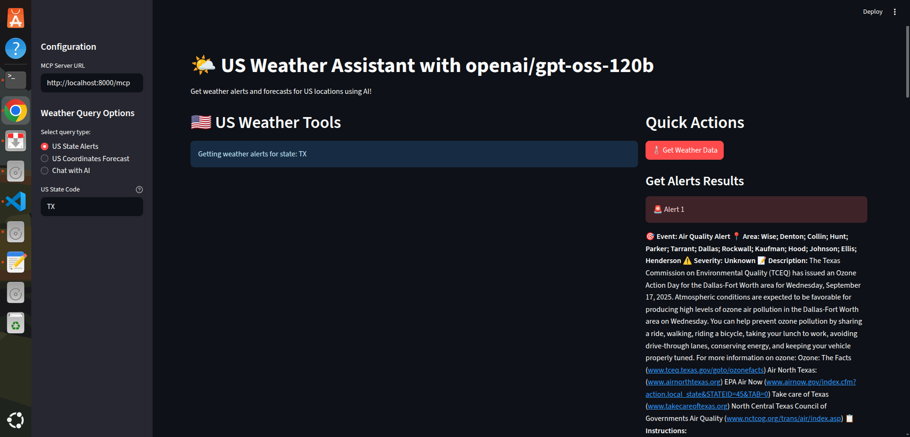
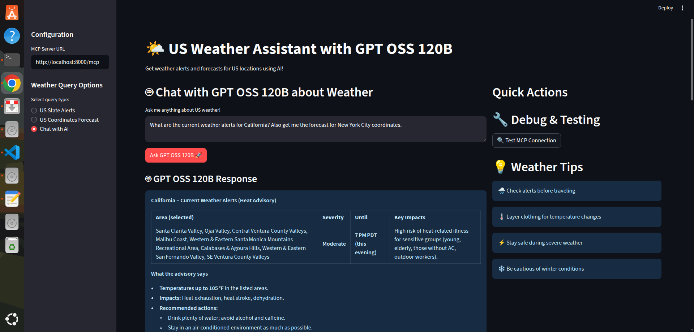

# Weather MCP Server




A two-part Python application for weather data and AI-powered assistance, featuring:

- **MCP Server**: FastMCP backend for weather data and API integration.
- **Streamlit Client**: Interactive web UI for users.

## Project Structure

```
.
├── client/
│   └── client.py
│   └── Dockerfile
├── mcp/
│   └── weather.py
│   └── Dockerfile
├── requirements.txt
├── docker-compose.yml
├── .env
```

## Prerequisites

- Docker & Docker Compose installed
- Python 3.11+ (for local development)
- A valid `GROQ_API_KEY` (for Groq API access)

## Setup

1. **Clone the repository**

   ```bash
   git clone <your-repo-url>
   cd mcp-project
   ```

2. **Create a `.env` file**
   ```
   GROQ_API_KEY=your_api_key_here
   ```

## Running with Docker Compose

1. **Build and start the services**

   ```bash
   docker compose up --build
   ```

2. **Access the application**

   - MCP Server: [http://localhost:8000](http://localhost:8000)
   - Streamlit Client: [http://localhost:8501](http://localhost:8501)

3. **Stop the services**
   Press `Ctrl+C` in the terminal, then:
   ```bash
   docker compose down
   ```

## Local Development

1. **Install dependencies**

   ```bash
   python -m venv venv
   source venv/bin/activate
   pip install -r requirements.txt
   ```

2. **Run MCP Server**

   ```bash
   python mcp/weather.py
   ```

3. **Run Streamlit Client**
   ```bash
   streamlit run client/client.py
   ```

## Environment Variables

- `GROQ_API_KEY`: Your Groq API key

## Troubleshooting

- **Docker cannot access `.env` file**  
  Remove the `volumes` section mounting `.env` in `docker-compose.yml`. Docker Compose will automatically use `.env` for environment variables.

- **Ports already in use**  
  Change the exposed ports in `docker-compose.yml` if 8000 or 8501 are busy.

- **Healthcheck fails**  
  Ensure `weather.py` exposes a `/health` endpoint.

## File Overview

- `client/client.py`: Streamlit web client
- `mcp/weather.py`: FastMCP server
- `requirements.txt`: Python dependencies
- `docker-compose.yml`: Multi-service orchestration
- `.env`: Secrets and API keys

## License

MIT
